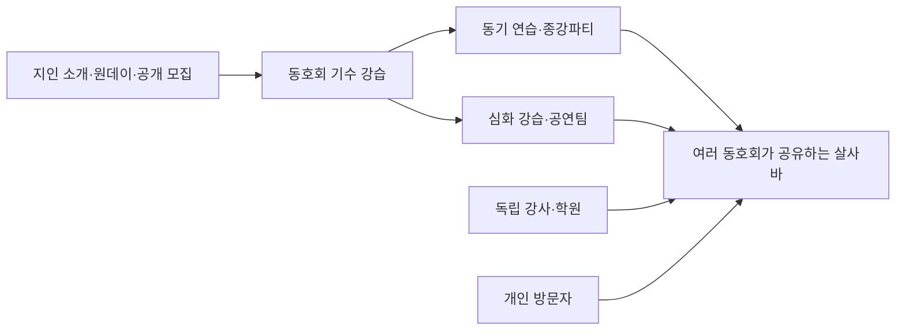

# 서울 살사 씬: 회원 글과 운영 원문 대조

> 2026-09-11 후속 확인: 현행 카페와 실제 회원 글을 추가 대조한 [심층 조사](salsa-cafe-source-research-2026-09-11.md)를 우선 참조한다. 에버라틴의 네이버 이전과 현재 활동, SA의 과거 모집·휴강 공지, 고정 글 본문 수정이 확인됐으므로 이전의 미확인/추정 판정은 그 기록으로 보완한다.

조사 기간: 2026-09-10~11 KST. 최신 원문 확인: 2026-09-11. 공개 자료를 이용한 질적 조사다. 앞선 `salsa-scene-research-2026-09-10.md`의 소스 발견 목록을 현재 활동이 검증된 동호회 명단으로 취급하지 않는다.

## 조사에서 수정한 판단

서울의 살사를 학원 목록이나 살사바 목록만으로 수집하면 누락과 중복이 생긴다. 확인한 자료에서는 **기수별 동호회가 입문과 관계 형성을 맡고, 강사·공연팀이 심화 강습을 제공하며, 여러 동호회가 살사바를 공유**한다. 이 세 주체는 같지 않다. 한 장소의 여러 홀에서 살사·바차타 등의 프로그램이 따로 열리는 사례도 있다. 이는 아래 사례를 종합한 해석이며 서울 전체의 인원·시장점유율 통계는 아니다.

회원 글은 활동 방식과 수집 위치를 파악하는 근거로 사용한다. 회원 가입인사는 출석 증명이 아니고, 모집 공지도 행사 개최 완료의 증명이 아니다. 이름·연락처·성별·나이 등 개별 회원 프로필은 운영 데이터에 수집하지 않는다.

## 회원이 실제로 쓴 내용

| 자료와 날짜 | 확인한 경험 또는 행동 | 해석의 범위와 한계 |
|---|---|---|
| [라스트댄스 공개 게시판](https://www.somoim.co.kr/31217e4a-d804-11ed-9914-0a32915246751), 2026-08-31 가입 글 2건 | 춤을 배운 경험이 없는 신규 가입자의 인사와 댓글이 노출된다. 운영자는 08-21에 09-09 개강 21기 모집을 공지했다. | 운영자 광고 외에 최근 가입 행동이 확인된다. 가입자가 실제로 수업에 출석했는지는 확인 불가. |
| [라틴소울 공개 게시판](https://www.somoim.co.kr/b8a2ccca-c4a8-11ee-a38f-0ac636f0bddd1), 2026-08-30·08-31·09-03 가입 글 3건 | 무경력 회원의 가입 글과 댓글이 있고, 운영자가 올린 08-22 강습 및 08-29 6주차 종강파티 공지의 장소는 홍대 보니따다. | 기수 강습과 종강파티가 연결된다. 이 3건을 만족도 후기나 출석자 수로 계산하지 않는다. |
| [살사댄스 무료체험교실 공개 게시판](https://www.somoim.co.kr/9bfe72d8-45be-11e7-ab45-22000b04e99f1), 2026-09-03 가입 글 1건 | 무경력 가입자의 글과 댓글이 있고, 09-06 운영 공지는 09-12 홍대 부에나빠 체험을 안내한다. | 원데이 체험이 입문 경로로 쓰인다. 플랫폼의 신청 숫자를 실제 참석 숫자로 보지 않는다. |
| [라틴댄스 취미생활 4년 경험담](https://mlbpark.donga.com/mp/b.php?b=bullpen&id=202306190082610931), 2023-06-19 | 지인의 소개로 동호회에 들어간 작성자가 기수 동기들과 초급부터 배우는 방식, 강남·홍대 소셜, 살사와 바차타를 함께 배우는 경험을 설명한다. | 한국어 장기 참여자 사례. 오래된 글이므로 당시 음악 비율·비용·연령대를 2026년 수치로 옮기지 않는다. |
| [압구정 탑바 토요 정모 방문기](https://lifeisordinary.tistory.com/68), 2025-02-23, 방문일 02-22 | 작성자가 여러 동호회 회원이 한 바에 모였고 소셜 전에 바차타 오픈강습에 참여했다고 적었다. 현장 사진이 있다. | 바가 여러 모임의 공통 장소라는 근거. 2026년 탑바 운영 확인 자료는 아니므로 신규 장소 등록 근거로 쓰지 않는다. |
| [서울에서 배운 회원의 답변](https://www.reddit.com/r/seoul/comments/1khir64/salsa_classes_in_seoul/), 2025-05-08 게시물 | 여러 동호회와 학원 한 곳을 경험했다는 응답자가 두 운영 방식의 차이를 설명하고, 본인이 배운 홍대 보스톤 카페와 강남 지인의 추천 카페를 연결한다. | 학원 표본이 한 곳이라는 본인 한계를 유지한다. 같은 글의 강사 모집 댓글은 독립 회원 후기에서 제외한다. |
| [서울 소셜 방문·거주자 토론](https://www.reddit.com/r/Salsa/comments/1nndbqc/planning_a_salsa_and_bachata_trip_to_seoul/), 2025-09~10 | 강남·홍대의 여러 바를 오가며 요일·홀·음악 배분을 보고 장소를 고른다는 경험이 나온다. 교통 때문에 평일 체류 시간이 짧다는 의견도 있다. | 지역별 분위기·실력 평가는 서로 다르며 개인 평가다. 특정 지역이나 바의 성격을 고정 등급으로 만들지 않는다. |
| [서울 씬에 대한 여러 방문자의 상반된 경험](https://www.reddit.com/r/Salsa/comments/1ocuknl/does_seoul_south_korea_have_one_of_the_worlds/), 2025-10 | 동기·강사·공연팀을 중심으로 어울린다는 관찰과, 혼자 방문해도 즐겁게 춤췄다는 반대 경험이 함께 있다. 원 게시물의 영상 장소가 서울인지 부산인지도 댓글에서 문제 제기됐다. | 외국 방문자 표본의 편향이 크다. 폐쇄성·친절도·민족 특성을 사실로 일반화하지 않는다. 홍보 글의 장소도 원문 대조가 필요하다는 사례로 사용한다. |
| [홍대 살사 참여자의 공개 발언문](https://equalityact.kr/actioncrew_01/), 행사 2026-06-21, 게시 06-26 | 리더 역할로 배우려다 여러 동호회에서 거절받고 다른 경로로 수강했다는 본인 경험이다. | 참여 조건과 역할 정책은 모임마다 확인할 필요가 있다는 사례. 특정 동호회가 식별되지 않으므로 개별 단체의 평가나 차단 근거로 쓰지 않는다. |
| [에버라틴 첫 체험 방문기](https://giri2.tistory.com/567), 2025-11-25 | 작성자는 초급 수업과 여러 홀을 설명하지만, 수업 뒤 소셜에는 다음에 남겠다고 적었다. | 일회 방문담이며 협찬 여부·장기 회원 여부는 미확인. 소셜 참가 후기 또는 현재 활동 확인으로 세지 않는다. |

서로 다른 동호회 페이지에 비슷한 시기의 가입 글이 있다는 사실만으로 한 사람의 모임 이동이나 중복 가입을 확정하지 않았다. 가입 글 6건도 6명의 검증된 참석자를 뜻하지 않는다.

## 회원 경험과 최신 운영 공지가 만나는 지점

[홍대 보니따 공식 카카오 채널](https://pf.kakao.com/_RIMtM)을 별도 브라우저로 열어 **9/9~9/15 주간 공지**와 매장 주소(서울 마포구 동교로 191, 디비엠빌딩 지하1층 B101)를 확인했다. 이 자료는 위 회원 경험담보다 최근이며, 운영자가 게시한 이번 주 편성표다.

- 라틴소울 회원 가입 글과 8월 종강파티 원문을, 보니따의 9월 12일 참여 모임 안내와 대조할 수 있다.
- 라스트댄스 신입 기수 모집 외에 보니따의 9월 12일 **15기 발표회**가 따로 나온다. 신입 기수와 공연 기수가 다르므로 하나의 강습으로 합치면 안 된다.
- SA·SDA·라틴속으로는 이번 주 참여 명단에도 나온다. 따라서 ‘최근 활동 흔적 없음’이라고 결론 내릴 수 없다. 다만 바의 참여 명단은 해당 단체의 신규 모집 게시판을 검증한 것과 다르다.
- 9월 11일은 공연 뒤 홀마다 살사와 바차타를 나눠 편성하고, 9월 14일은 수업만 열고 소셜은 쉰다. 요일 반복만으로 소셜 일정을 자동 생성하면 실제 운영과 어긋난다.

[DSN Crew의 9월 17일 운영 공지](https://www.meetup.com/ko-kr/dsn-crew/events/mmdjztyjcmbwb/)는 별도 스튜디오의 입문 강습과 강남 클럽 라틴의 소셜을 연결한다. 이것은 **소셜 운영 커뮤니티·주최자** 사례다. 날짜는 미래지만 본문 신청 마감이 7월로 남아 있어 강습 일정을 그대로 복사하지 않는다. 강남 라틴의 주소(테헤란로6길9 B2)는 행사 주최 원문에서도 교차 확인된다.

회원이 서술한 참여 흐름과 운영 공지를 종합하면 아래와 같다. 모든 사람이 이 순서를 밟는다는 뜻은 아니다.

**수집의 중심은 사람이 아니라 운영 공지다.** 회원 글로 어떤 모임·장소·게시판을 봐야 하는지 알아낸 뒤, 모집은 모임 원장, 소셜·휴무는 바 원장, 별도 워크숍은 주최자 원문에서 확인한다. ‘동호회가 활발하다’와 ‘학원보다 시장점유율이 높다’는 다른 주장이고, 후자는 이번 공개 표본으로 판정할 수 없다. On1·On2·쿠반 등 스타일 역시 게시물에 명시된 경우만 사용한다.

## 현재 활동과 고정 수집 위치 검증

판정은 세 가지를 구분한다. **최근 원문 확인**은 최근 날짜가 있는 운영자 공지 또는 공개 회원 활동을 서울 장소와 함께 확인했다는 뜻이다. **후보**는 존재·일부 최근 흔적은 있으나 필수 대조가 끝나지 않았다는 뜻이다. **보류**는 오래된 소개나 접근 제한만으로 현재 활동을 확정할 수 없다는 뜻이다.

| 단체 / 유형 | 서울 근거와 최근 원문 | 판정 / 적용 범위 |
|---|---|---|
| 라틴파라다이스 / 동호회 | [운영 소모임](https://www.somoim.co.kr/c7cf108d-f40f-4c09-ba82-5f8765c595bb1): 09-12 149기 모집, 강남 턴빠, 08-23 모집 글 | 최근 모집 원문 확인. 기존 원데이·동호회 고정 링크에 적합. 소개의 6만원과 일정의 5만원이 달라 비용을 복사하지 않는다. |
| 라스트댄스 / 동호회 | 위 공개 원장에 09-09 기수 공지와 08-31 신입 글, 홍대입구 인근 수업 안내 | 최근 원문 확인. 고정 링크에 적합. 특정 강습실 주소는 미확정이므로 임의 핀을 찍지 않는다. |
| 라틴소울 / 동호회 | 위 공개 원장에 08-29 보니따 종강파티 공지와 09-03 신입 글 | 최근 원문 확인. 고정 링크에 적합. 소개문에 남은 05-30 개강일을 신규 일정으로 재등록하지 않는다. |
| 살사댄스 무료체험교실 / 원데이 운영 모임 | 위 공개 원장에 연도까지 명시된 2026-09-12 체험, 부에나빠, 09-06 공지 | 최근 원문 확인. 이름 없는 다른 동호회와 임의로 합치지 않고 원데이 모임으로 표시. ‘무료’와 가격 필드 ‘1원’이 충돌하므로 가격 확정 금지. |
| 딴따라클럽 / 동아리 | [공개 소모임](https://www.somoim.co.kr/4815f134-20c6-11ee-91fe-0a372a1b7bbd1), 06-24 강남대로94길55 강습실 안내, [공식 지원 링크](https://litt.ly/tantaraclubofficial) | 서울 활동 구조 확인. 9월 기수·최근 회원 출석은 미확인이라 이번 등록은 보류. |
| 라틴속으로 / 동호회 | [8~9월 강습을 옮긴 자료](https://danceinfo.net/lessons/2870), [보니따 08-20 정모 자료](https://www.socialdancelive.com/posters/latin-meetup-hongdae-26-08-20-bachata-workshop-seoul-salsa-2026-08-20-2487da1e?lang=en), 운영 계정 `intothelatinittl` | 보니따 공식 09-10·09-12 참여 명단으로 최근 서울 활동도 교차 확인. 단체 모집 원장 본문 접근은 실패했으므로 신규 강습 자동등록 연결은 보류. |
| SA / 동호회 | [공식 Linktree](https://linktr.ee/sa.latin.official) 서울 커뮤니티 소개, 검색 노출에 55차 09-13 신청서 | 보니따 공식 09-11·09-12·09-15 참여 명단으로 최근 서울 활동 확인. 신청서 연도·본문과 다음 카페는 미확인이므로 현재 기수 모집 링크 등록은 보류. |
| 에버라틴 / 학원·동호회 혼합 | [공식 사이트](https://everlatin.com/), 2025-11 체험담. 사이트 수업 후기의 확인된 글은 2023년 | 존재는 확인. 현재 기수 원문 미확인이므로 최근 활동 동호회 명단에서 보류. |
| SDA / 동호회·강습 운영 | [공개 소모임](https://www.somoim.co.kr/8c626ba8-bd62-11ef-b1d2-0ae0a353992b1): 가장 최근 노출 회원 글 2025-01, 2026년 강습은 2차 자료에서 발견 | 보니따 공식 09-09·09-12 참여 명단으로 최근 서울 활동 확인. 오래된 소모임 대신 현재 모집 원장을 더 확인해야 하므로 강습 연결은 보류. |
| Latin SNL / 강습 운영 모임 | [09-05 홍턴 강습 자료](https://www.socialdancelive.com/posters/latin-snl-salsa-bachata-hongdae-class-26-09-05-seoul-2026-09-05-b995f9e1?lang=en) | 운영 계정 접근 제한. 동호회와 홍턴 장소를 하나의 단체로 합치지 않고 후보 유지. |
| 라틴라온 / 동호회 | [09-22 홍턴 초급 모집 자료](https://danceinfo.net/lessons/3261) | 운영자 원본 채널이 아직 연결되지 않아 후보. |
| AK Salsa / 강사·학원 | [공식 사이트](https://www.aksalsa.com/about-1), 2026년 7~8월 강습은 재게시 사이트에서 발견 | 현재 공식 강습 원문 미확인. 학원을 일반 동호회로 등록하지 않는다. |
| JDC / 학원·국제 커뮤니티 | [공식 Meetup](https://www.meetup.com/ko-kr/seoul-latin-dance-salsa-bachata-jhonatan-jimenez/)에서 앞선 조사 때 09-12 강남 수업 확인 | 별도 학원/영어 수업 후보. 이번 재접근은 제한돼 추가 확인하지 못했다. 일반 서울 동호회 수를 늘리는 데 사용하지 않는다. |
| 강남 라틴 / 살사바·복수 홀 | [운영 원문](https://www.instagram.com/latin_gangnam/p/DdFQ871k89c/), 앞선 조사에서 09-10 운영과 테헤란로6길9 확인 | 장소로 분리 가능. 이 바에서 열리는 모든 프로그램을 살사 일정으로 분류하면 안 된다. |
| 홍대 보니따 / 살사바 | [공식 카카오 채널](https://pf.kakao.com/_RIMtM)의 09-09~15 운영 공지·매장 주소·공식 프로필 로고, 라틴소울 원장의 장소명이 일치 | 최근 장소 운영 확인. 기존 살사바 분류에 등록 가능. 휴무·홀별 프로그램은 개별 일정 검증 대상. |
| DSN Crew / 소셜·강습 운영 커뮤니티 | [공식 Meetup](https://www.meetup.com/ko-kr/dsn-crew/events/mmdjztyjcmbwb/)의 2026-09-17 파티, 강남 라틴 주소와 별도 스튜디오 강습 안내 | 최근 원문 확인. 바·일반 기수 동호회와 구별. 본문의 지난 신청 마감 때문에 강습 자동등록은 보류. |
| 홍턴 / 살사바 | [운영 장소 소개 및 이용자 후기](https://www.daangn.com/kr/local-profile/%ED%99%8D%ED%84%B4-dre4r2g92oku/), 서울 동교로207, 수정일 2026-05-05. 최신 강습은 2차 자료 | 직접 페이지 재접근 403. 소개·최근 사용 여부의 대조를 끝내기 전 추가 등록 보류. |
| 부에나 / 살사바 | 무료체험교실 원장의 09-12 장소로 확인 | 바 자체의 최신 운영 채널·주소 대조가 부족해 장소 레코드 생성 보류. 체험 모임의 장소명은 유지 가능. |

‘서울’과 ‘수도권’을 합치지 않았다. 수원·분당·안산 및 부산·제주 단체는 서울 활동 동호회 명단에서 제외했다. 검색결과의 카페 회원 수·팔로워 수·‘최대’ 표현은 실제 활동 인구 검증 자료가 아니다.

## 수집 설계로 연결되는 구조

1. **고정 소스는 단체별 모집 게시판과 장소별 운영 게시판을 나눠 잡는다.** 같은 바를 사용하는 동호회가 여러 개이고, 강사는 여러 단체에서 수업할 수 있다. 기존 이벤트의 주최·장소·강사 정보를 재사용한다.
2. **신규 판정은 게시물 식별자와 실제 개강일로 한다.** 소개 문구는 오래 남고 새 기수는 게시판에만 올라오는 사례가 있다. 기존 `source_url + date` 중복 방지와 후보 검증을 유지한다. 단체 홈페이지가 갱신됐다는 이유만으로 일정 생성 금지.
3. **하나의 원문에 기수 수업, 소셜, 종강파티가 섞일 수 있다.** 회차 날짜·신청 기한·발표회 날짜를 구분한다. 과거 시작 강습의 마지막 회차를 새 강습으로 등록하지 않는다.
4. **살사와 바차타를 주소나 바 이름만으로 판정하지 않는다.** 원문의 종목·홀·프로그램을 확인한다. 같은 소셜을 장르마다 별도 행으로 복제하지 않고 기존 분류 체계를 따른다.
5. **후기는 수집 소스 발견과 운영 상태 대조용이다.** 후기·가입인사·동영상 촬영 날짜를 캘린더 날짜로 등록하지 않는다. 일정 후보는 실제 운영 공지 본문으로 검증한다.
6. **게시판의 라벨도 신뢰할 수 없다.** 소모임의 ‘모임후기’ 아래에 미래 일정의 자동 안내와 모집 광고가 있었다. 작성 주체·내용·날짜를 함께 확인한다.
7. **현재 자동수집 프로필은 함부로 확대하지 않는다.** 기존 `collection-registry.mjs`의 `expanded-research` / `expanded-ingestion` 경계를 유지한다. 공개 원문·개별 게시물 주소·날짜·장소를 안정적으로 읽는 것까지 검증한 소스만 자동등록에 연결한다. 이번 고정 링크 등록은 자동수집 가동 완료를 뜻하지 않는다.

## 접근·표본 한계

공개 웹 원문 추출과 별도의 브라우저 탐색을 대조했다. 소모임의 공개 소개·예정 정모는 브라우저에서도 확인했다. 공개 웹 원문에 노출된 회원 글·댓글 수를 읽었으나, 브라우저의 게시판 전환은 본문이 안정적으로 로드되지 않아 개별 게시물 전체와 비공개 댓글까지 검증했다고 주장하지 않는다. 실제 회원 신원·출석·회비 결제도 확인하지 않았다.

네이버 블로그 robots 제한, 일부 인스타그램의 로그인·호출 제한, 다음 카페 접근 제한은 우회하지 않았다. 이 때문에 공개 자료가 적은 대형 동호회가 누락될 수 있다. 오래된 체험담, 운영자가 쓴 후기, 재게시 사이트의 일정은 각각 구분했다. 따라서 이 문서는 **검증 가능한 공개 사례에 근거한 구조 조사 및 등록 후보 판정표**이며 서울 전수조사나 인기 순위가 아니다.

## 사이트 반영 대상과 연구 자료의 경계

최근 모집·회원 활동의 원문과 서울 장소를 확인한 라틴파라다이스, 라스트댄스, 라틴소울, 살사댄스 무료체험교실 **4개 고정 링크**를 기존 원데이·동호회 레코드에 `dance_scope=salsa`로 반영했다(2026-09-11). 원데이 운영 모임을 특정 동호회 소속으로 추정하지 않는다. 장소는 공식 주소와 실제 로고까지 확인한 **홍대 보니따 1곳**을 기존 `venues`의 살사바 분류로 등록했다. 신규 이벤트·개인 회원 데이터는 만들지 않았다. 운영 화면에서 4개 링크와 1개 장소, 기존 스윙 링크 보존을 확인했다.

나머지 행도 무조건 비활동 단체라는 뜻은 아니다. 현재 활동의 교차 근거와 ‘사용자가 신청할 고정 원장’의 검증 수준을 각각 남겼다. 이 명단을 전체 서울 살사 동호회 수로 표현하지 않는다.
